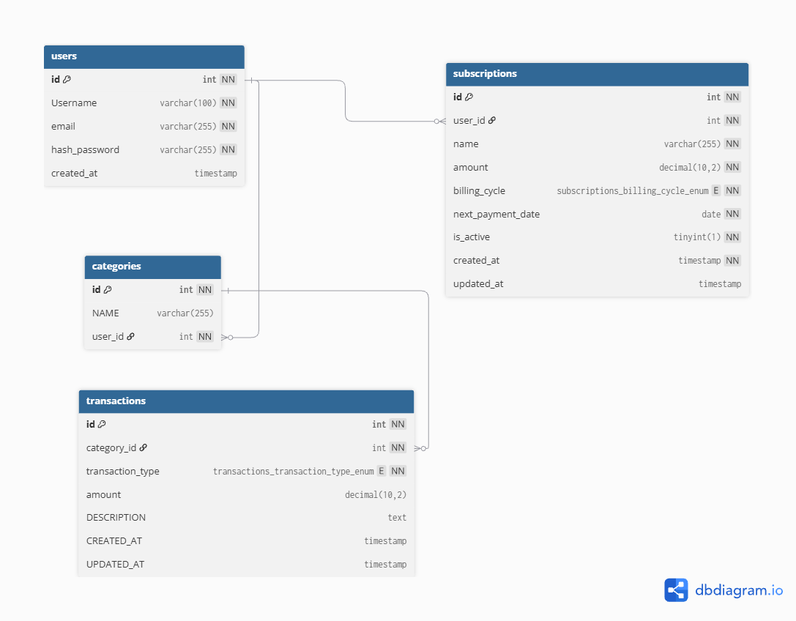

<p align="center">
  
</p>

# SpendOops

SpendOops is a personal finance and subscription tracking application built with vanilla PHP, MySQL and PDO.

## Project Overview

SpendOops is a personal finance application focused on tracking everyday income, expenses and recurring subscriptions.

The project was inspired by a common problem with subscription services: cancelling too early can mean losing access to already paid time, while waiting until the end of the billing period makes it easy to forget about the next payment.

SpendOops aims to make recurring payments easier to track by keeping subscriptions, payment dates and personal finances in one place.

The project is also being developed as a practical way to improve my backend development skills using vanilla PHP before going deeper into frameworks such as Laravel.

## Screenshot


## Features

- User registration and login
- Secure password hashing with `password_hash()` and `password_verify()`
- User-specific income and expense tracking
- User-specific transaction categories
- Add, view and delete transactions
- Create and view subscriptions
- Activate and deactivate subscriptions
- Subscription billing cycle and next payment date tracking
- CSRF protection for state-changing requests
- PDO prepared statements for database queries

## Tech Stack

- PHP
- MySQL
- PDO
- JavaScript
- HTML
- Tailwind CSS
- Composer

## Database Schema



The application uses a database with four main tables:

- `users`
- `categories`
- `transactions`
- `subscriptions`

### Users

The `Users` table stores information about registered users.

Each user has their own account and can manage their personal transactions, categories and subscriptions.

### Categories

The `Categories` table stores transaction categories, such as:

- Food
- Transport
- Entertainment
- Bills

  Categories are used to organize transactions and make expenses easier to track.

### Transactions

The `Transactions` table stores user's financial transactions.

Each transaction contains information such as:

- transaction type
- amount
- description
- category

Transactions are associated with a user through their category.

### Subscriptions

The `subscriptions` table stores recurring subscriptions belonging to each user.

Each subscription contains:

- name
- amount
- billing cycle
- next payment date
- active status

Users can currently create subscriptions, view their subscriptions and change whether a subscription is active or inactive.

## Table Relationships

- One `user` can have many `categories`.
- One `category` belongs to one `user`.
- One `category` can have many `transactions`.
- One `transaction` belongs to one `category`.
- A `transaction` is associated with a `user` through its `category`.
- One `user` can have many `subscriptions`.
- One `subscription` belongs to one `user`.
- Deleting a user also deletes their subscriptions through `ON DELETE CASCADE`.

This structure keeps each user's financial data separated from other users.

## Setup

1. Clone this repository

2. Install PHP dependencies:

```bash
composer install
```

3. Install frontend dependencies:

```bash
npm install
```

4. Create a MySQL database.

5. Import:

```bash
database/schema.sql
```

6. Copy the database configuration example:

```bash
cp config/database.example.php config/database.php
```

7. Update the database credentials in:

```bash
config/database.php
```

8. Build Tailwind CSS:

```bash
npx @tailwindcss/cli -i ./src/css/input.css -o ./public/css/output.css
```

9. Start the PHP development server:

```bash
php -S localhost:8000 -t public
```

10. Open the application in your browser:
    http://localhost:8000

## Roadmap

- Edit subscription details
- Upcoming subscription payment reminders
- Monthly subscription cost summary
- Dashboard financial statistics
- Transaction filtering and sorting
- Automated tests
- Further UI and responsive design improvements
